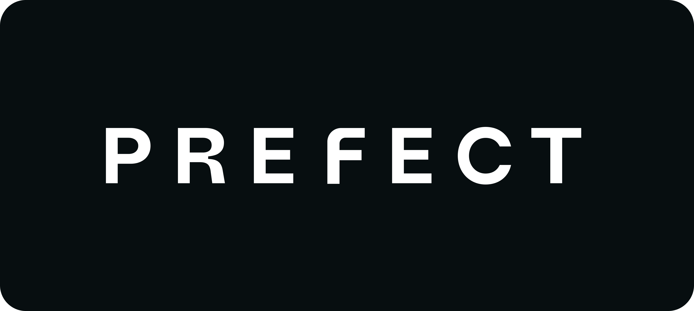

# Prefect Associate Certification Course late 2024

Find code from slides that can be used as a starting point for labs in each of the module folders.

Refer to the [Tech Setup Guide](https://docs.google.com/document/d/136OtdLNrYOiYsOXTYPluxnFlnkyWpyZ08rp-7sq6PFc/edit?usp=sharing) if you have any issues getting your environment set up.

We'll walk through authenticating your CLI to Prefect Cloud. If you have any issues, check out the slides.

This repository works with Prefect 3.
